# HealthCoachAI Architecture

## Overview

HealthCoachAI is a comprehensive, production-ready AI-powered health and
wellness platform designed to deliver celebrity-grade nutrition and fitness
coaching with clinical accuracy. This document outlines the system architecture,
design principles, and technical implementation strategy.

## Architecture Principles

### Core Design Principles

1. **Security and Privacy by Design**: OWASP ASVS compliance, end-to-end
   encryption, DLP for external AI calls
2. **Accuracy-First AI Routing**: Level 1 (health reports) = highest accuracy;
   Level 2 (general) = cost-optimized
3. **Production-Ready**: No placeholders, full testing coverage, comprehensive
   monitoring
4. **Scalability**: India-first, globally scalable to 10M+ users
5. **Performance**: API p95 < 2s, mobile launch < 3s, offline-first capabilities
6. **Accessibility**: WCAG 2.1 AA compliance, inclusive design patterns

### Technology Stack

#### Frontend (Mobile)

- **iOS**: SwiftUI + Combine, Swift Package Manager
- **Android**: Kotlin + Jetpack Compose, Gradle
- **Shared**: Design system tokens, offline-first architecture

#### Backend

- **Framework**: NestJS (Node.js + TypeScript)
- **Database**: PostgreSQL 15+ with pgvector for embeddings
- **Cache**: Redis 7+ for session and application caching
- **Storage**: S3-compatible object storage for files
- **Search**: OpenSearch (alternative: Elasticsearch)

#### AI and ML

- **Orchestration**: n8n for AI workflows and routing
- **Providers**: OpenAI, Anthropic, Google Vertex, OpenRouter, Together
- **Level 1**: GPT-4.1, Claude Sonnet 4, Gemini 2.5 Pro (highest accuracy)
- **Level 2**: Llama 3.1 70B, Mixtral 8x22B, Qwen2-72B (cost-optimized)
- **OCR**: Google Document AI (primary), AWS Textract (fallback)

#### Infrastructure

- **Containers**: Docker with multi-stage builds
- **Orchestration**: Kubernetes (production), Docker Compose (development)
- **CI/CD**: GitHub Actions with security gates
- **Monitoring**: OpenTelemetry, Prometheus, Grafana
- **Secrets**: Cloud Secret Manager, encrypted environment variables

## System Architecture

### High-Level Architecture

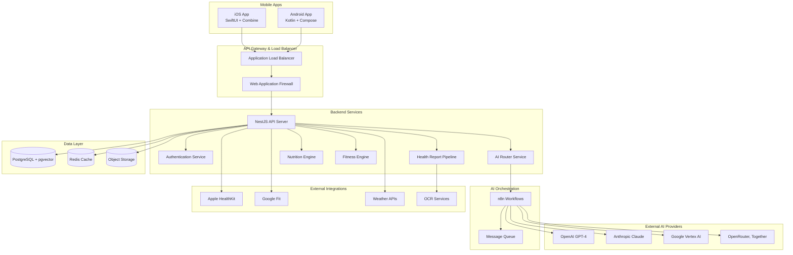

### Domain-Driven Design

#### Core Domains

1. **User Management Domain**
   - Authentication and authorization
   - User profiles and preferences
   - Consent and privacy management
   - Device and session management

2. **Health Data Domain**
   - Health report processing (OCR → NER → Interpretation)
   - Biometric data and measurements
   - Medical history and conditions
   - Health goal tracking

3. **Nutrition Domain**
   - Food database and nutrient calculations
   - Recipe corpus and meal planning
   - Glycemic index/load calculations
   - Cooking transformations and yields

4. **Fitness Domain**
   - Exercise database and workout library
   - Fitness planning and periodization
   - Progress tracking and adaptation
   - Safety and contraindications

5. **AI and ML Domain**
   - AI routing and decision logic
   - Model orchestration and fallbacks
   - DLP and pseudonymization
   - Cost and accuracy optimization

6. **Integration Domain**
   - Wearable device integrations
   - External API management
   - Webhook processing
   - Third-party data synchronization

### Microservices Architecture

#### Service Breakdown

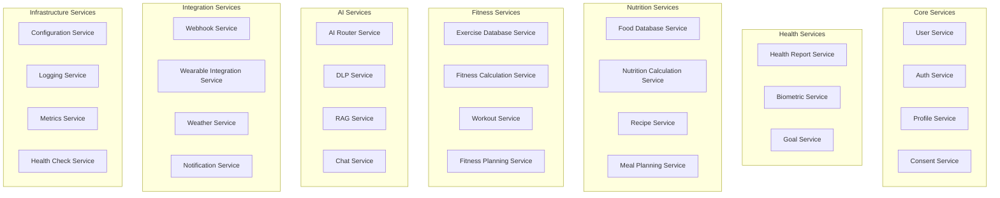

## Data Architecture

### Database Design

#### Primary Database (PostgreSQL)

**Core Tables:**

- `users` - User accounts and basic information
- `profiles` - User health profiles and preferences
- `consents` - Privacy and data usage consents
- `health_reports` - Processed health report metadata
- `biometrics` - User measurements and vital signs
- `goals` - Health and fitness objectives
- `meal_plans` - Generated meal plans and adaptations
- `fitness_plans` - Workout plans and progressions
- `logs` - User activity and progress logs
- `ai_decisions` - AI routing and decision audit trail

**Vector Tables (pgvector):**

- `embeddings` - Text embeddings for RAG
- `recipe_vectors` - Recipe similarity vectors
- `user_vectors` - User preference vectors

#### Caching Strategy (Redis)

**Cache Patterns:**

- Session data (15 minutes TTL)
- API responses (varies by endpoint)
- Nutrition calculations (24 hours TTL)
- AI responses (varies by type and accuracy)
- User preferences (1 hour TTL)
- Static content (CDN cache)

#### Object Storage (S3)

**Bucket Structure:**

```
healthcoachai-prod/
├── health-reports/          # Encrypted health documents
├── profile-images/          # User profile pictures
├── recipe-images/           # Recipe photos
├── workout-videos/          # Exercise demonstration videos
├── exports/                 # User data exports
└── backups/                # Database backups
```

### Data Flow Architecture

#### Health Report Processing Pipeline

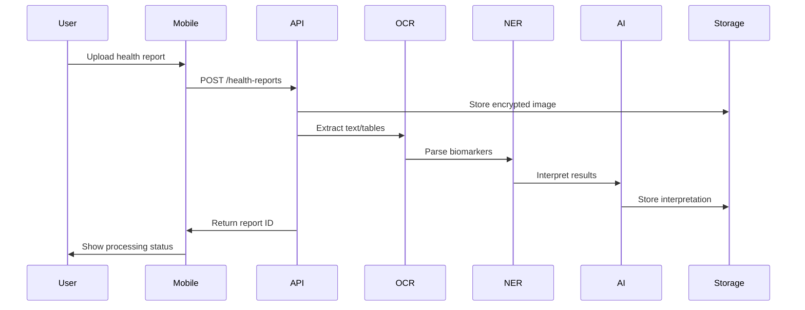

#### AI Routing Decision Flow

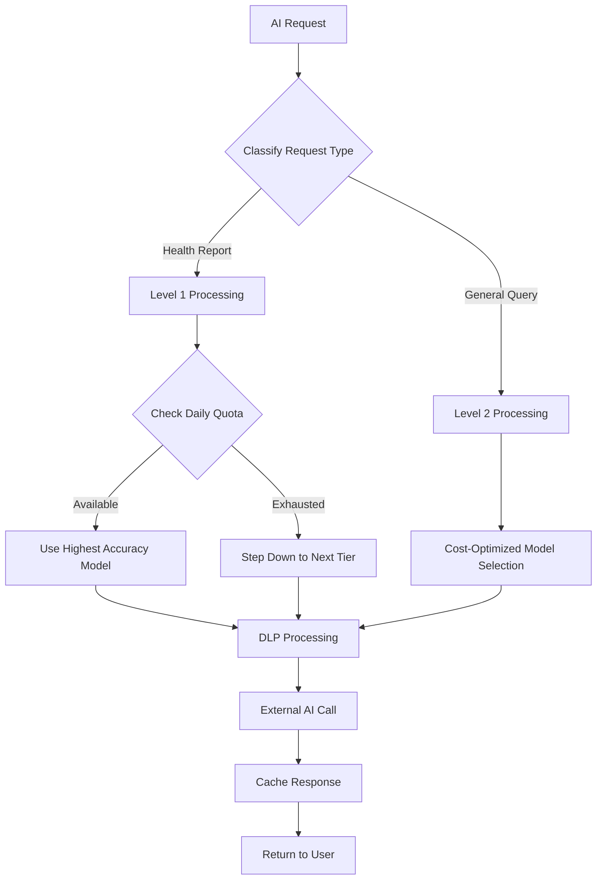

## Security Architecture

### Zero Trust Security Model

#### Identity and Access Management

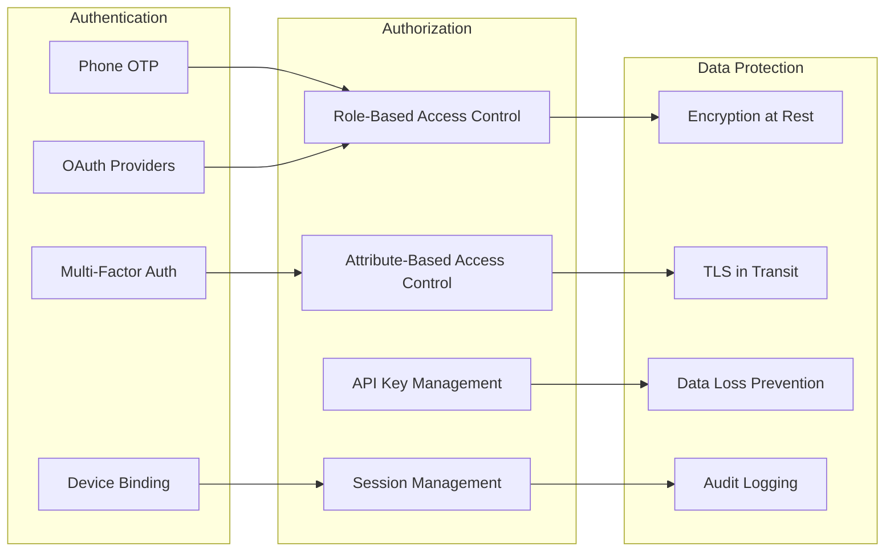

#### Network Security

**Defense in Depth:**

1. **Perimeter**: WAF, DDoS protection, geo-blocking
2. **Network**: VPC, security groups, network ACLs
3. **Application**: Input validation, output encoding, CSRF protection
4. **Data**: Encryption, access controls, audit logging
5. **Monitoring**: SIEM, anomaly detection, incident response

### Privacy Architecture

#### Data Minimization and Purpose Limitation

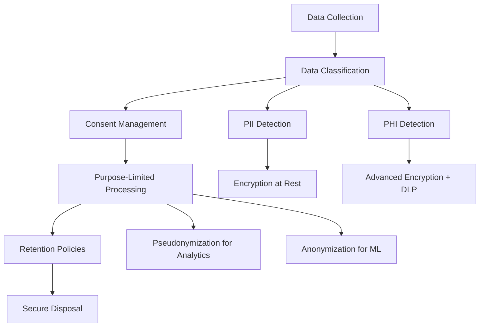

## AI and ML Architecture

### AI Router Architecture

#### Model Selection Logic

```typescript
interface AIRoutingPolicy {
  level1: {
    providers: ['openai-gpt4', 'anthropic-claude4', 'google-gemini2.5'];
    quotaTiers: [100, 200, 500]; // Daily quota tiers
    fallbackAccuracy: 0.98; // Minimum accuracy threshold
  };
  level2: {
    providers: ['llama3.1-70b', 'mixtral-8x22b', 'qwen2-72b'];
    accuracyWindow: 0.05; // 5% accuracy window
    costOptimization: true;
  };
  dlp: {
    enabled: true;
    piiDetection: true;
    pseudonymization: true;
    zeroRetention: true;
  };
}
```

#### n8n Workflow Architecture

**Core Workflows:**

1. **AI Router Orchestrator**: Model selection and fallback handling
2. **Health Report Pipeline**: OCR → NER → Interpretation
3. **Daily Plan Runner**: Meal and fitness plan generation
4. **Weekly Adaptation**: Progress analysis and plan updates
5. **Quota Reset**: Daily quota tier reset
6. **Notification Scheduler**: Hydration, meal, workout reminders

### RAG (Retrieval-Augmented Generation) Architecture

#### Knowledge Base Structure

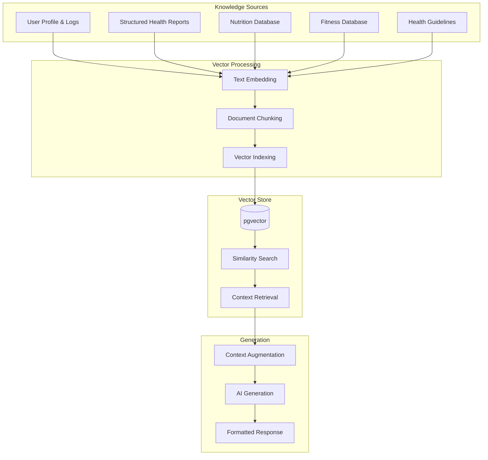

## Performance Architecture

### Caching Strategy

#### Multi-Level Caching

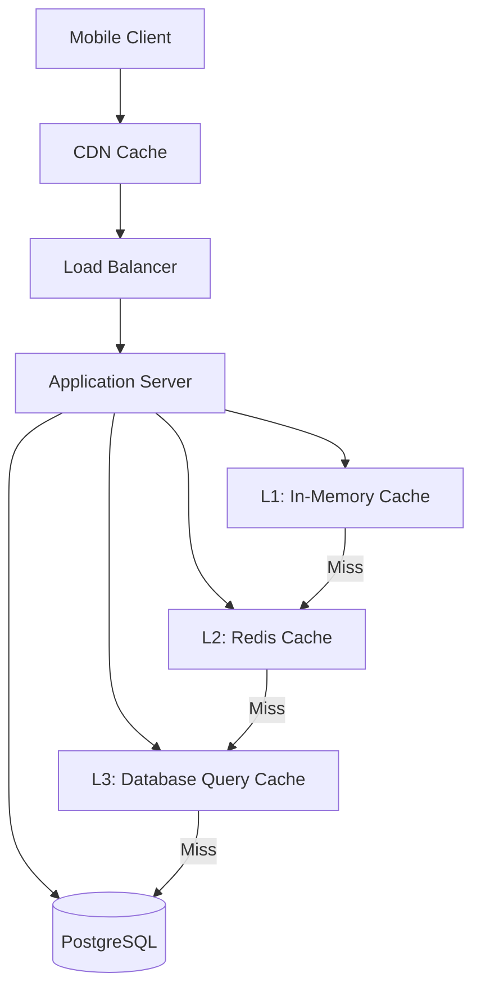

**Cache Hierarchy:**

- **L1 (In-Memory)**: Frequently accessed data (< 1ms)
- **L2 (Redis)**: Session data, API responses (< 5ms)
- **L3 (Query Cache)**: Database query results (< 50ms)
- **CDN**: Static assets, images (< 100ms)

### Scalability Architecture

#### Horizontal Scaling

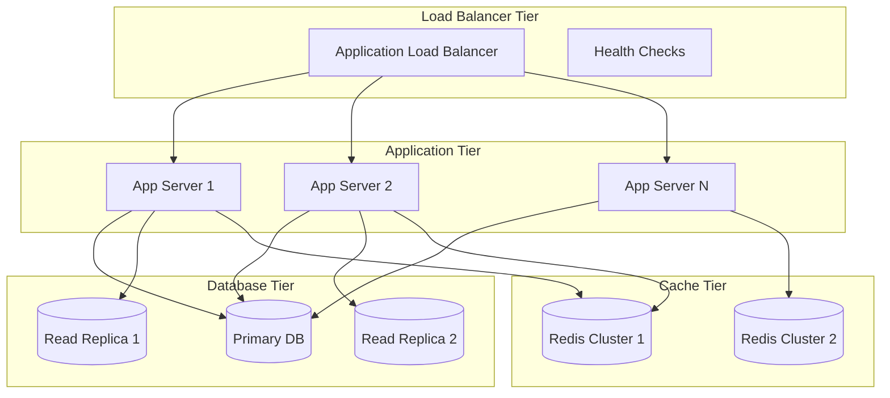

## Monitoring and Observability

### OpenTelemetry Implementation

#### Telemetry Stack

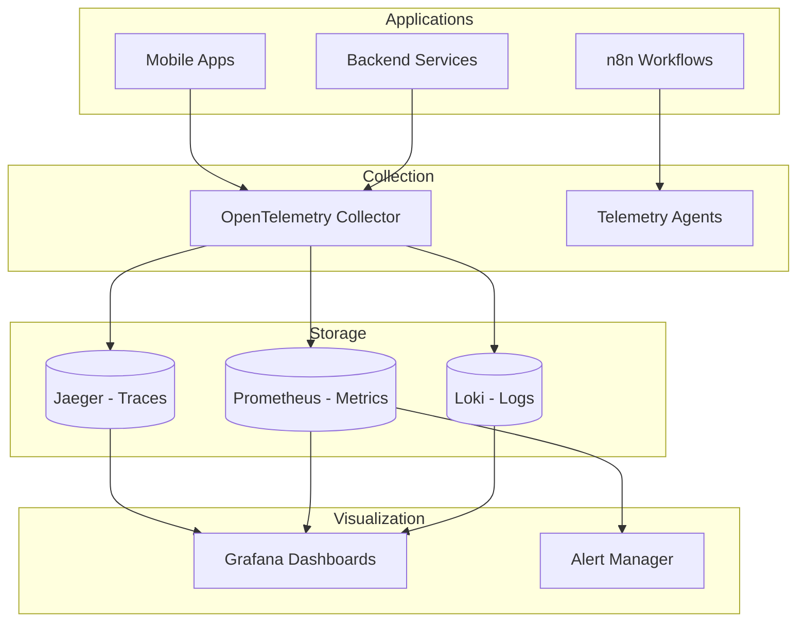

#### Key Metrics and SLOs

**Performance SLOs:**

- API Response Time: p95 < 2s, p99 < 5s
- Mobile App Launch: < 3s cold start
- Database Query Time: p95 < 100ms
- Cache Hit Rate: > 90% for frequent data

**Availability SLOs:**

- API Uptime: 99.9% (< 8.77 hours downtime/year)
- Mobile App Availability: 99.95%
- Data Consistency: 99.99%

**Business Metrics:**

- AI Model Accuracy: Level 1 > 95%, Level 2 > 90%
- User Engagement: Daily/Monthly active users
- Feature Adoption: Onboarding completion rates
- Cost Metrics: AI cost per request, infrastructure cost per user

## Deployment Architecture

### CI/CD Pipeline

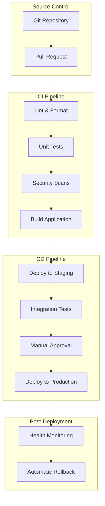

### Environment Strategy

**Environment Progression:**

1. **Development**: Local development, feature branches
2. **Testing**: Automated testing, integration validation
3. **Staging**: Production-like environment, manual testing
4. **Production**: Live environment, blue-green deployment

## Disaster Recovery and Business Continuity

### Backup Strategy

#### Data Backup

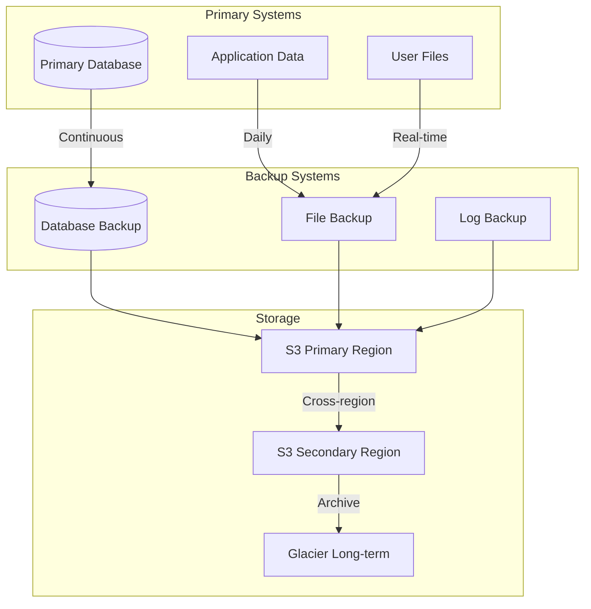

**Recovery Objectives:**

- **RTO (Recovery Time Objective)**: < 4 hours
- **RPO (Recovery Point Objective)**: < 1 hour
- **Data Retention**: 7 years for critical data

### High Availability

#### Multi-Region Deployment

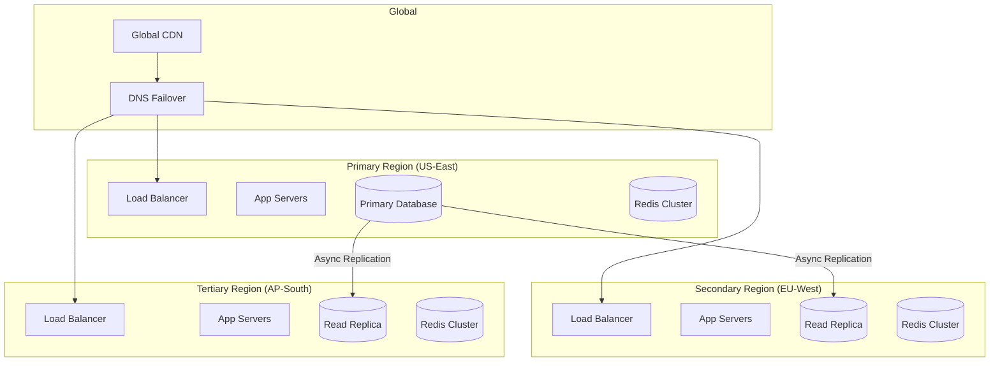

## Technology Decisions and Trade-offs

### Key Technology Choices

#### Backend Framework: NestJS

**Chosen for:**

- TypeScript-first approach
- Modular architecture support
- Built-in dependency injection
- Comprehensive testing support
- Strong ecosystem and community

**Trade-offs:**

- Slightly higher learning curve
- Node.js performance limitations for CPU-intensive tasks
- Memory usage higher than compiled languages

#### Database: PostgreSQL + pgvector

**Chosen for:**

- ACID compliance and reliability
- Rich ecosystem and tooling
- Built-in vector search capabilities
- Strong consistency guarantees
- Excellent performance for complex queries

**Trade-offs:**

- Vertical scaling limitations
- More complex setup than NoSQL alternatives
- Higher operational overhead

#### Mobile: Native Development

**Chosen for:**

- Best performance and user experience
- Full platform feature access
- Better security model
- Platform-specific optimizations

**Trade-offs:**

- Higher development cost
- Dual codebase maintenance
- Longer time to market

#### AI Orchestration: n8n

**Chosen for:**

- Visual workflow design
- Extensive connector ecosystem
- Self-hosted deployment option
- Cost-effective compared to cloud alternatives

**Trade-offs:**

- Less mature than enterprise alternatives
- Limited enterprise features
- Requires additional operational overhead

### Future Architecture Considerations

#### Potential Enhancements

1. **Event-Driven Architecture**: Implement event sourcing for better audit
   trails and system resilience
2. **Service Mesh**: Consider Istio for advanced traffic management and security
3. **Edge Computing**: Deploy edge nodes for reduced latency in key markets
4. **Machine Learning Ops**: Implement MLOps pipelines for model training and
   deployment
5. **Blockchain Integration**: Consider for secure health data sharing and
   interoperability

#### Scaling Considerations

- **Database Sharding**: Implement when single database reaches capacity limits
- **Microservice Extraction**: Break monolithic services into smaller, focused
  services
- **Cache Warming**: Implement intelligent cache warming for improved
  performance
- **Auto-scaling**: Implement predictive auto-scaling based on usage patterns
- **Global Distribution**: Expand to additional regions based on user growth

---

_This architecture document is a living document and will be updated as the
system evolves and new requirements emerge._
