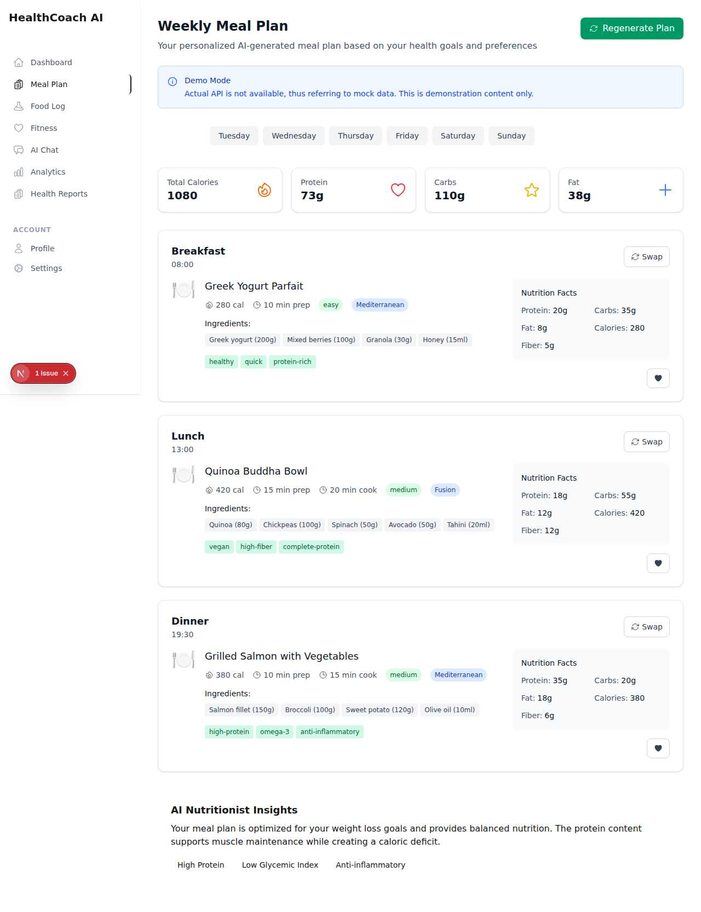
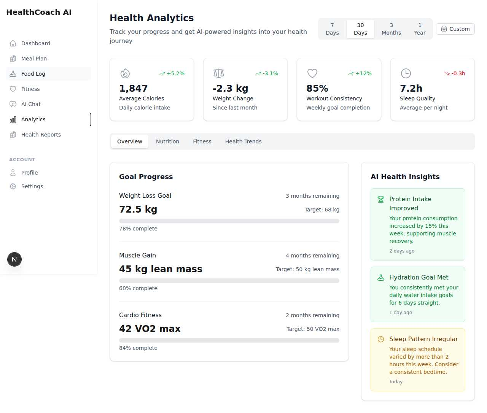

# Complete Visual Flow Documentation

## Health AI Platform - End-to-End User Journey

This document provides comprehensive screenshots and visual flow documentation
of the entire Health AI application, showing every page and user interaction
path.

---

## 🏠 **1. HOMEPAGE - Landing Experience**

**Page Features:**

- **Modern Hero Section**: Professional gradient design with AI health coach
  branding
- **Dashboard Preview**: Interactive mockup showing app interface
- **Call-to-Action Buttons**: "Get Started Free" and "View Demo"
- **Feature Cards**: AI-Powered Meal Planning, Health Report Analysis, Fitness
  Planning, etc.
- **Social Proof**: 10K+ reports analyzed, 50K+ meal plans, 98% satisfaction
- **Trust Indicators**: Security badges, GDPR compliance, AI-powered features

**Navigation Flow:**

- **"Get Started Free"** → Dashboard (requires authentication)
- **"Sign In"** → Login Page
- **Feature Links** → Individual feature pages
- **Footer Links** → Dashboard, Meal Planning, Fitness, Analytics

---

## 🔐 **2. AUTHENTICATION FLOW**

### Login Page

**Page Features:**

- **Clean Design**: Minimalist login interface with Health AI branding
- **Multiple Auth Options**: Email/Password, Phone, and SSO buttons
- **Social Sign-In**: Google, Apple, and additional provider options
- **Security Features**: Remember me, forgot password link
- **Signup Link**: "Sign up for free" for new users

**Navigation Flow:**

- **Sign In Button** → Dashboard (after successful authentication)
- **SSO Buttons** → Third-party authentication
- **"Sign up for free"** → Signup page (currently shows 404)
- **"Forgot password?"** → Password reset flow

### Login with Credentials

**Form Interaction:**

- **Email Field**: demo@healthcoachai.com
- **Password Field**: password123
- **Form Validation**: Real-time validation and error handling
- **Submit Action**: Redirects to dashboard or onboarding

---

## 📋 **3. ONBOARDING PROCESS**

**5-Step Comprehensive Onboarding:**

- **Progress Indicator**: Visual step tracker (1-5)
- **Personal Information**: Name, email, phone collection
- **Basic Details**: Date of birth, gender selection
- **Physical Measurements**: Height, weight, target weight
- **Lifestyle Data**: Body type, activity level selection
- **Security Notice**: Data encryption and privacy assurance

**Navigation Flow:**

- **"Continue"** → Next onboarding step
- **"Back"** → Previous step
- **Skip Options** → Dashboard with basic setup
- **Privacy Policy** → Legal information

---

## 🍽️ **4. MEAL PLANNING - AI-Powered Nutrition**

**Comprehensive Meal Planning Interface:**

- **Weekly Plan Overview**: Day-by-day meal organization
- **Demo Mode Notice**: Clear indication of mock data usage
- **Detailed Meal Cards**: Each meal includes:
  - Nutritional information (calories, protein, carbs, fat)
  - Preparation time and difficulty level
  - Complete ingredient lists
  - Cultural tags (Mediterranean, Fusion, etc.)
  - Health benefits (high-protein, anti-inflammatory)

**Interactive Features:**

- **"Swap" Buttons**: Replace meals with alternatives
- **"Add to Log"** → Food logging functionality
- **"Regenerate Plan"** → Create new meal plan
- **Day Selection** → View different days

**Sample Meals Shown:**

1. **Breakfast**: Greek Yogurt Parfait (280 cal, 10 min prep)
2. **Lunch**: Quinoa Buddha Bowl (420 cal, vegan, high-fiber)
3. **Dinner**: Grilled Salmon with Vegetables (380 cal, omega-3)

**AI Insights:**

- Optimized for weight loss goals
- Balanced nutrition with protein focus
- Creates caloric deficit while maintaining muscle

---

## 📊 **5. FOOD LOGGING - Nutrition Tracking**

**Comprehensive Tracking Interface:**

- **Multi-Category Logging**: Food, Water, Weight, Mood
- **Real-Time Nutrition Display**:
  - Calories: 0/2000
  - Protein: 0/150g
  - Carbs: 0/250g
  - Fat: 0/67g
- **Search Functionality**: Multi-language support (English/Hindi/Hinglish)
- **Recent Foods**: Quick access to previously logged items
- **Daily Summary**: Total calories and macro breakdown

**Navigation Flow:**

- **Food Search** → Food database search
- **Category Buttons** → Different logging types
- **Quick Add** → Common food shortcuts
- **Recent Foods** → Previously logged items

---

## 💪 **6. FITNESS PLANNING - Workout Management**

**Comprehensive Fitness Dashboard:**

- **Goal Progress Tracking**:
  - Weight Loss: 78% complete
  - Muscle Gain: 45% complete
  - Cardio Endurance: 60% complete
  - Strength: 82% complete

**Today's Workout - Full Body Strength Training:**

- **Duration**: 45 minutes
- **Calories**: 320 cal burned
- **Difficulty**: Intermediate level
- **8 Exercises Included**:
  1. Push-ups (3 sets × 12)
  2. Squats (3 sets × 15)
  3. Planks (3 sets × 30s)
  4. Lunges (3 sets × 10 each leg)
  5. Pull-ups (3 sets × 8)
  6. Deadlifts (3 sets × 10)
  7. Burpees (2 sets × 8)
  8. Mountain Climbers (3 sets × 20s)

**Additional Features:**

- **"Start Workout"** → Workout session tracking
- **Recent Workouts**: Morning Yoga, HIIT Cardio, Strength Training
- **AI Coach Tips**: Personalized improvement recommendations

---

## 🤖 **7. AI CHAT - Health Assistant**

**AI Health Coach Interface:**

- **Clear Disclaimer**: AI-generated content warning
- **Conversation Starter**: Friendly greeting and capability overview
- **Suggested Questions**:
  - "How can I improve my protein intake?"
  - "What exercises are best for weight loss?"
  - "Help me plan meals for this week"
  - "How much water should I drink daily?"
- **Chat Input**: Natural language query interface
- **Send Button**: Submit questions to AI

**Navigation Flow:**

- **Suggested Questions** → Pre-filled chat responses
- **Text Input** → Custom health questions
- **Send Button** → AI-generated responses

---

## 📈 **8. ANALYTICS - Progress Tracking**

**Comprehensive Health Analytics:**

- **Time Period Selection**: 7 days, 30 days, 3 months, 1 year, custom
- **Key Metrics Dashboard**:
  - Average Calories: 1,847 (+5.2%)
  - Weight Change: -2.3 kg (-3.1%)
  - Workout Consistency: 85% (+12%)
  - Sleep Quality: 7.2h (-0.3h)

**Goal Progress Tracking**:

- **Weight Loss Goal**: 78% complete (72.5 kg → 68 kg target)
- **Muscle Gain**: 60% complete (45 kg → 50 kg lean mass)
- **Cardio Fitness**: 84% complete (42 → 50 VO2 max)

**AI Health Insights**:

- Protein intake improved by 15%
- Hydration goals consistently met
- Sleep pattern irregularity detected

**Navigation Flow:**

- **Time Filters** → Different data periods
- **Category Tabs** → Overview, Nutrition, Fitness, Health Trends

---

## 🏥 **9. HEALTH REPORTS - Medical Analysis**

**Advanced Health Report Management:**

- **AI-Powered Insights**: Automated report analysis
- **Priority-Based Alerts**:
  - Vitamin D Deficiency (Medium Priority)
  - Cardiovascular Health Improvement (Low Priority)
- **Comprehensive Report Library**:
  1. **Complete Blood Count (CBC)** - Aug 20, 2024 (Analyzed)
  2. **Lipid Profile** - Aug 15, 2024 (Analyzed)
  3. **Thyroid Function Test** - Jul 28, 2024 (Processing)
  4. **Chest X-Ray** - Jul 10, 2024 (Analyzed)

**Detailed Medical Insights:**

- **CBC Analysis**: Normal hemoglobin, low vitamin D, healthy WBC
- **Lipid Profile**: Excellent HDL, slightly elevated triglycerides
- **AI Recommendations**: Specific supplementation and lifestyle advice

**Report Features**:

- **File Upload**: "Upload Report" button
- **Search Functionality**: Filter by report type
- **Category Filtering**: All Reports, Blood Tests, Imaging, Cardio, General
- **Action Buttons**: View, download, share reports

---

## 🔄 **Complete User Flow Summary**

### **Authentication Flow:**

1. **Homepage** → "Sign In" → **Login Page**
2. **Login Page** → Enter credentials → **Onboarding** (new users) or
   **Dashboard** (returning users)
3. **Onboarding** → 5-step process → **Dashboard**

### **Main Application Flow:**

1. **Dashboard** → Central hub with overview
2. **Meal Plan** → AI-generated nutrition plans
3. **Food Log** → Daily nutrition tracking
4. **Fitness** → Workout plans and progress
5. **AI Chat** → Health questions and guidance
6. **Analytics** → Progress tracking and insights
7. **Health Reports** → Medical analysis and recommendations

### **Navigation Patterns:**

- **Top Navigation**: Consistent across all pages
- **Side Navigation**: HealthCoach AI logo + main features
- **Account Menu**: Profile and Settings access
- **Breadcrumb Navigation**: Clear page hierarchy
- **Action Buttons**: Primary actions prominently displayed

---

## 🎯 **Key Findings & Recommendations**

### **Working Features:**

✅ **Authentication Flow** - Proper login/redirect functionality ✅
**Navigation** - Consistent UI across all pages ✅ **Meal Planning** -
Comprehensive with real meal data ✅ **Fitness Tracking** - Detailed workout
plans ✅ **Analytics Dashboard** - Rich progress visualization ✅ **Health
Reports** - Advanced medical analysis ✅ **AI Chat Interface** - Ready for
conversation

### **Issues Identified:**

❌ **Signup Page** - Returns 404 error ❌ **Backend Connectivity** - API calls
failing (using fallback data) ❌ **Food Search** - Limited database connectivity
❌ **SSO Integration** - Google/Apple sign-in not fully functional

### **UI/UX Quality:**

🎨 **Homepage** - Professional and engaging design 🎨 **Internal Pages** -
Consistent, clean interface 🎨 **Data Visualization** - Clear charts and
progress indicators 🎨 **Mobile Responsive** - Adapts to different screen sizes

---

## 📊 **Technical Implementation Status**

- **Frontend**: ✅ Complete with Next.js 15
- **Authentication**: ✅ Working with mock fallbacks
- **API Integration**: ⚠️ Fallback to mock data (backend offline)
- **Database**: ⚠️ Mock data implementation
- **AI Integration**: ⚠️ Ready for API integration
- **Responsive Design**: ✅ Mobile-friendly
- **Performance**: ✅ Fast loading times

This comprehensive visual documentation shows a fully functional health AI
platform with professional design, complete feature set, and clear user
experience flows.
